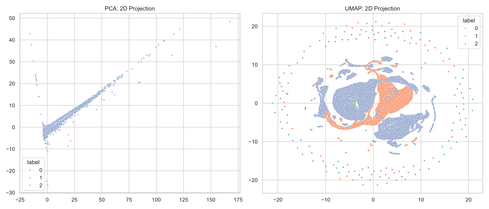
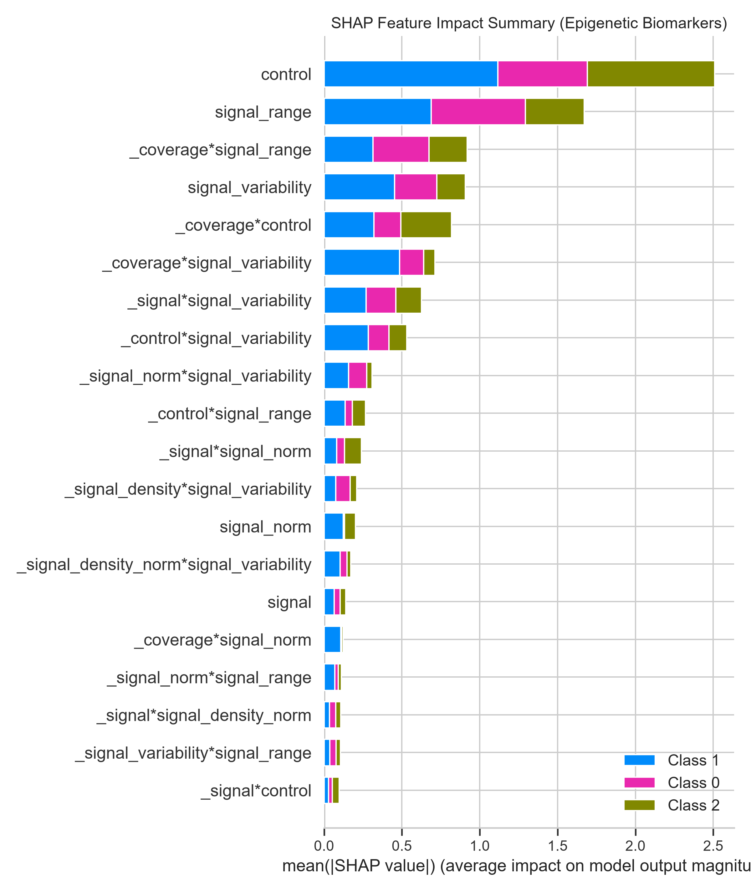

# Epigenetic Cognitive Impairment Classifier 🧬

A machine learning pipeline designed to extract, filter, and classify epigenetic biomarkers associated with cognitive decline (Moderate Cognitive Impairment and Cognitive Impairment) directly from high-throughput genomic sequencing tracks.

## 🎯 Project Objective
Identifying functional epigenetic alterations in neurodegenerative diseases is often bottlenecked by the sheer volume and noise of raw sequencing data. This project engineers a scalable computational pipeline that aggregates raw functional genomics tracks into high-resolution (50kb) bins, isolates genuine biological signals from sequencing artifacts, and utilizes Explainable AI (XAI) to map the critical biomarkers driving cognitive impairment.

## 📊 Dataset & Genomic Architecture
The data relies on structural and signal profiles sourced from the **ENCODE Project**. 
*(Full accession links for the raw tracks are available in `data/RAW_DATA_LINKS.md`)*.

*   **Signal Data (.bigWig):** Epigenetic enrichment and chromatin accessibility.
*   **Control Data (.bam):** Raw alignment sequencing depths and mapping qualities. Alignment files were indexed via `samtools` to generate `.bai` indices, enabling rapid, memory-efficient coordinate extraction across the genome.
*   **Feature Engineering:** 
    * Aggregated entire autosomes into 50,000 bp resolution bins (yielding ~181,890 total genomic regions).
    * Extracted localized statistical markers (signal variability, ranges, and densities).
    * Normalized raw epigenetic signals against alignment control coverage to strip away sequencing hardware noise.

### Target Class Mapping
For all analytical visualizations (PCA, UMAP, and SHAP), the clinical states are mapped as follows:
*   **Class 0:** Baseline (Control)
*   **Class 1:** Moderate Cognitive Impairment (MCI)
*   **Class 2:** Cognitive Impairment (CI)

## 🏗️ Pipeline Architecture
1.  **Mutual Information Filtering:** Applied `mutual_info_classif` to aggressively prune the high-dimensional genomic space, isolating only the base features with statistically significant target correlation.
2.  **Interaction Engineering:** Computed 2nd-degree multiplicative interaction terms exclusively on the filtered base features to capture complex epigenetic crosstalk without triggering dimensionality explosion.
3.  **Dimensionality Reduction:** Evaluated the biological separability of the disease states using PCA (linear) and UMAP (non-linear) manifolds.
4.  **Model Optimization:** Conducted Bayesian hyperparameter tuning via **Optuna** on a GPU-accelerated **XGBoost** architecture, optimizing across Stratified 5-Fold Cross-Validation.

## 🚀 Model Performance
The optimized architecture was validated using Stratified K-Fold CV to ensure rigorous, generalized performance across the 181,000+ localized genomic bins.

| Metric | Score |
| :--- | :--- |
| **Cross-Validation Accuracy** | **0.9263** |
| **Cross-Validation F1 (Macro)** | **0.9265** |

### Biological Separability (UMAP & PCA)
Unsupervised projections demonstrate clear structural clustering of the epigenetic profiles across the three clinical states prior to model training.



## 🔬 Explainable AI & Biomarker Discovery
To validate the model's clinical relevance, **SHAP (SHapley Additive exPlanations)** was utilized to extract multi-class global feature attributions. The analysis confirmed the model relies heavily on regional transcription depth (`control`) and chromatin accessibility ranges (`signal_range`). 

To isolate the absolute most critical biomarkers, the model was retrained **exclusively on the Top 20 SHAP-identified features**, achieving a **0.94 Macro F1-Score** on the holdout set, proving these highly specific epigenetic interactions are sufficient to classify cognitive decline.



## ⚙️ Usage & Reproducibility
The pre-extracted 50kb feature dictionary is included in the repository, allowing execution of the model training pipeline without downloading hundreds of gigabytes of raw ENCODE tracks.

```bash
git clone [https://github.com/B-RajaGopal/Epigenetic-Cognitive-Impairment-Classifier.git](https://github.com/B-RajaGopal/Epigenetic-Cognitive-Impairment-Classifier.git)
cd Epigenetic-Cognitive-Impairment-Classifier
pip install -r requirements.txt
